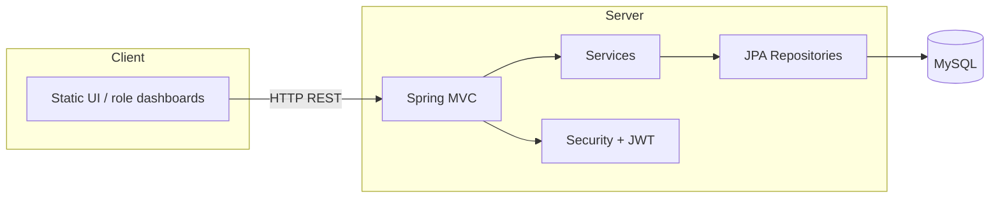

<div align="center">

# Intelligent Logistics Management Platform

**Multi-role integrated logistics system**

[](https://openjdk.org/)
[](https://spring.io/projects/spring-boot)
[](https://www.mysql.com/)
[](LICENSE)

[中文](README.md) · [Repository](https://github.com/wmlqq/logistic)

</div>

---

## Overview

A **B/S logistics management system** built for coursework and portfolio use. The backend exposes REST APIs with JWT-based access control; the frontend is role-based static HTML covering ordering, warehousing, delivery, finance, and administration.

## Tech Stack

| Layer | Technologies |
|-------|----------------|
| Runtime | Java 17 |
| Backend | Spring Boot 3.5, Spring MVC, Spring Data JPA, Spring Security |
| Auth | JWT (jjwt 0.12) + BCrypt |
| Database | MySQL 8+ |
| Extras | Apache POI (Excel), Spring Mail, DingTalk robot webhook (optional) |
| Build | Maven 3.6+ (Maven Wrapper included) |
| Frontend | HTML5, Bootstrap 5, jQuery, Font Awesome |
| CI | GitHub Actions |

## Features by Role

| Role | Capabilities |
|------|----------------|
| Customer | Registration, addresses, order placement & tracking |
| Logistics manager | Order dispatch, couriers, warehouses, reports |
| Warehouse admin | Inventory, locations, import/export, alerts |
| Courier | Delivery tasks, route planning |
| Finance | Order & financial reports |
| System admin | Users & roles, settings, audit logs, DB backup/restore |

## Repository Layout

```
logistic/
├── .github/workflows/     # CI pipeline
├── database/seed/         # backup.sql seed data
├── docs/diagrams/         # Architecture & flow diagrams
├── scripts/               # DB init helpers
├── src/main/java/         # Backend source
├── src/main/resources/
│   ├── application.yaml
│   ├── application-example.yaml
│   └── static/            # Frontend assets
└── pom.xml
```

## Quick Start

### Prerequisites

- JDK **17+**
- **MySQL 8.0+**
- (Optional) `mysql` / `mysqldump` CLI for admin backup features

### 1. Clone

```bash
git clone https://github.com/wmlqq/logistic.git
cd logistic
```

### 2. Initialize database

**Windows:**

```powershell
.\scripts\init-db.ps1 -User root -Password your_password
```

**Linux / macOS:**

```bash
chmod +x scripts/init-db.sh
./scripts/init-db.sh root your_password
```

Default admin after seed import: **`admin` / `admin`**.

### 3. Configure the app

```bash
cp src/main/resources/application-example.yaml src/main/resources/application-local.yaml
```

Edit `application-local.yaml` (never commit it) or set environment variables:

```bash
export SPRING_DATASOURCE_PASSWORD=your_password
export APP_JWT_SECRET=your-long-random-secret
```

### 4. Run

```bash
./mvnw spring-boot:run
# Windows: mvnw.cmd spring-boot:run
```

Open **http://localhost:8080**

### 5. Package

```bash
./mvnw clean package -DskipTests
java -jar target/logistic-0.0.1-SNAPSHOT.jar
```

## Configuration

| Property | Environment variable | Description |
|----------|----------------------|-------------|
| JDBC URL | `SPRING_DATASOURCE_URL` | MySQL connection string |
| DB user | `SPRING_DATASOURCE_USERNAME` | Default `root` |
| DB password | `SPRING_DATASOURCE_PASSWORD` | Required |
| JWT secret | `APP_JWT_SECRET` | Change in production |
| Backup dir | `LOGISTIC_BACKUP_DIR` | Default `~/.logistic/backups` |
| DingTalk | `DINGTALK_ROBOT_WEBHOOK` | Empty = disabled |

See [`application-example.yaml`](src/main/resources/application-example.yaml).

## Architecture



Diagrams: [`docs/diagrams/`](docs/diagrams/).

## Security

- Do not commit `application-local.yaml`, `.env`, or real credentials.
- Rotate any secrets that may have been exposed in older commits.

## License

[MIT License](LICENSE)

## Links

- Repository: https://github.com/wmlqq/logistic
- 中文说明：[README.md](README.md)
