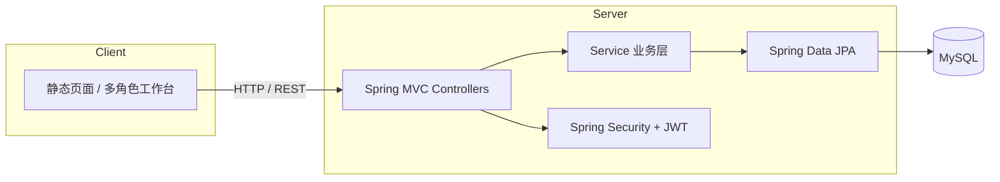

<div align="center">

# 智能物流管理平台

**西北工业大学 · 软件工程实验 G · 多角色一体化物流业务系统**

[](https://openjdk.org/)
[](https://spring.io/projects/spring-boot)
[](https://www.mysql.com/)
[](LICENSE)

[English](README.en.md) · [在线仓库](https://github.com/wmlqq/logistic)

</div>

---

## 项目简介

面向课程与展示场景设计的 **B/S 架构智能物流管理系统**：后端提供 REST API 与权限控制，前端以静态页面按角色划分工作台，覆盖下单、仓储、配送、财务与系统运维等完整链路。

## 技术栈

| 层级 | 技术 |
|------|------|
| 语言 / 运行时 | Java 17 |
| 后端框架 | Spring Boot 3.5、Spring MVC、Spring Data JPA、Spring Security |
| 认证 | JWT（jjwt 0.12）+ BCrypt 密码 |
| 数据库 | MySQL 8+ |
| 其他能力 | Apache POI（Excel）、Spring Mail、钉钉机器人 Webhook（可选） |
| 构建 | Maven 3.6+（含 Maven Wrapper） |
| 前端 | HTML5、Bootstrap 5、jQuery、Font Awesome |
| CI | GitHub Actions |

## 功能概览

| 角色 | 主要能力 |
|------|----------|
| 客户 | 注册登录、地址管理、下单与订单跟踪 |
| 物流经理 | 订单调度、配送员管理、仓库与报表 |
| 仓库管理员 | 库存、库位、出入库、库存预警 |
| 配送员 | 配送任务、路线规划 |
| 财务人员 | 订单与财务报表 |
| 系统管理员 | 用户与角色、系统设置、操作日志、数据库备份/恢复 |

## 项目结构

```
logistic/
├── .github/workflows/     # CI 流水线
├── database/seed/         # 数据库初始化脚本 backup.sql
├── docs/diagrams/         # 架构与流程图（Graphviz / PlantUML）
├── scripts/               # 数据库初始化脚本
├── src/main/java/         # 后端业务代码
├── src/main/resources/
│   ├── application.yaml           # 默认配置（无敏感信息）
│   ├── application-example.yaml   # 配置示例
│   └── static/                    # 前端静态资源
└── pom.xml
```

## 快速开始

### 环境要求

- JDK **17+**
- **MySQL 8.0+**（本地或远程）
- （可选）本机已安装 `mysql` / `mysqldump` 客户端（管理员备份功能需要）

### 1. 克隆仓库

```bash
git clone https://github.com/wmlqq/logistic.git
cd logistic
```

### 2. 初始化数据库

**Windows（PowerShell）：**

```powershell
.\scripts\init-db.ps1 -User root -Password your_password
```

**Linux / macOS：**

```bash
chmod +x scripts/init-db.sh
./scripts/init-db.sh root your_password
```

或手动执行：

```sql
CREATE DATABASE IF NOT EXISTS mylogistic CHARACTER SET utf8mb4 COLLATE utf8mb4_unicode_ci;
```

```bash
mysql -u root -p mylogistic < database/seed/backup.sql
```

> 导入种子数据后默认管理员：**用户名 `admin`，密码 `admin`**（BCrypt 存储）。

### 3. 配置应用

复制示例配置并填写本地信息（**勿提交** `application-local.yaml`）：

```bash
cp src/main/resources/application-example.yaml src/main/resources/application-local.yaml
```

编辑 `application-local.yaml`，至少设置：

- `spring.datasource.username` / `password`
- `app.jwt.secret`（至少 32 位随机字符串）
- （可选）`dingtalk.robot.webhook`

也可通过环境变量覆盖，例如：

```bash
export SPRING_DATASOURCE_PASSWORD=your_password
export APP_JWT_SECRET=your-long-random-secret
```

### 4. 启动

```bash
# 使用 Maven Wrapper（推荐）
./mvnw spring-boot:run

# Windows
mvnw.cmd spring-boot:run
```

浏览器访问：**http://localhost:8080**

### 5. 打包运行

```bash
./mvnw clean package -DskipTests
java -jar target/logistic-0.0.1-SNAPSHOT.jar
```

## 配置说明

| 配置项 | 环境变量 | 说明 |
|--------|----------|------|
| 数据库 URL | `SPRING_DATASOURCE_URL` | JDBC 连接串 |
| 数据库用户 | `SPRING_DATASOURCE_USERNAME` | 默认 `root` |
| 数据库密码 | `SPRING_DATASOURCE_PASSWORD` | 必填 |
| JWT 密钥 | `APP_JWT_SECRET` | 生产环境务必修改 |
| 备份目录 | `LOGISTIC_BACKUP_DIR` | 默认 `~/.logistic/backups` |
| 钉钉 Webhook | `DINGTALK_ROBOT_WEBHOOK` | 留空则跳过通知 |

完整示例见 [`application-example.yaml`](src/main/resources/application-example.yaml)。

## 架构示意



更详细的组件与订单流程图见 [`docs/diagrams/`](docs/diagrams/)。

## 常见问题

**无法连接数据库**  
确认 MySQL 已启动、库名 `mylogistic` 已创建、账号密码与 `application-local.yaml` 一致。

**登录失败**  
确认已导入 `database/seed/backup.sql`；管理员默认 `admin` / `admin`。

**管理员备份失败**  
需本机 PATH 中存在 `mysqldump` 与 `mysql`，且应用使用的数据库账号具备相应权限。

## 安全提示

- 请勿将 `application-local.yaml`、`.env` 或真实密码提交到 Git。
- 若仓库历史中曾包含密钥，请在 GitHub 与对应服务（MySQL、钉钉等）**轮换密钥**。

## 许可证

本项目采用 [MIT License](LICENSE) 开源。

## 相关链接

- 仓库：https://github.com/wmlqq/logistic
- English README：[README.en.md](README.en.md)
